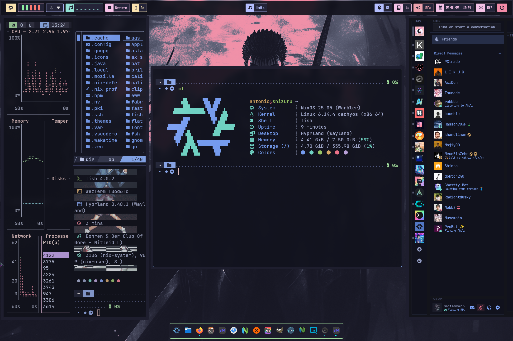
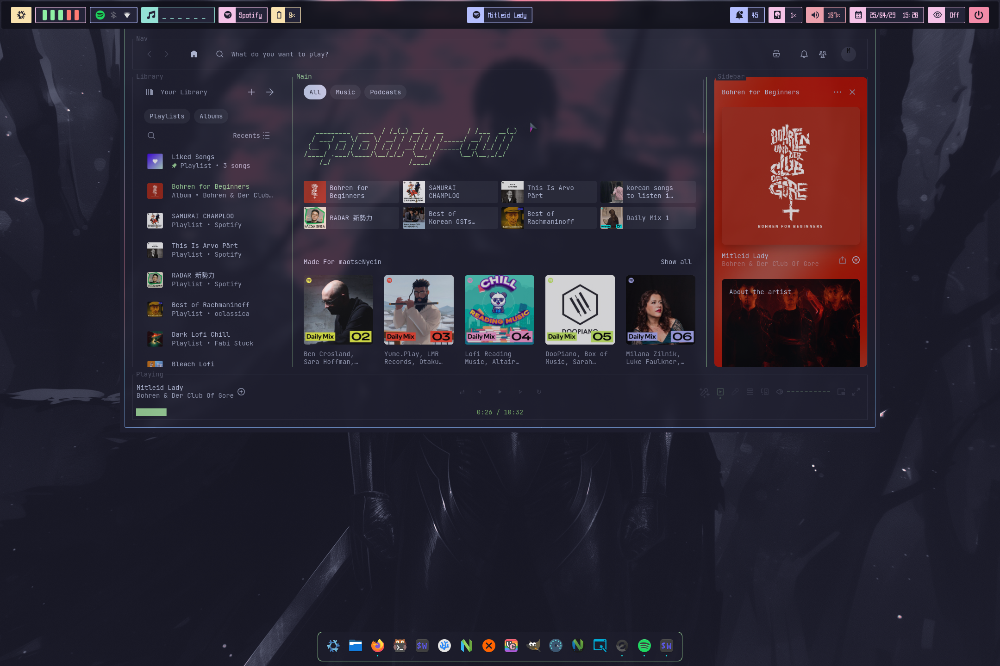
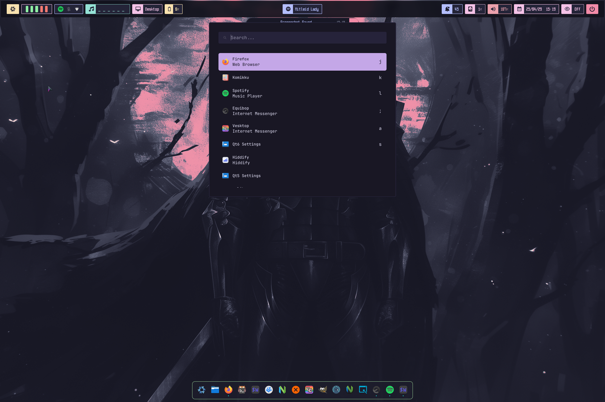
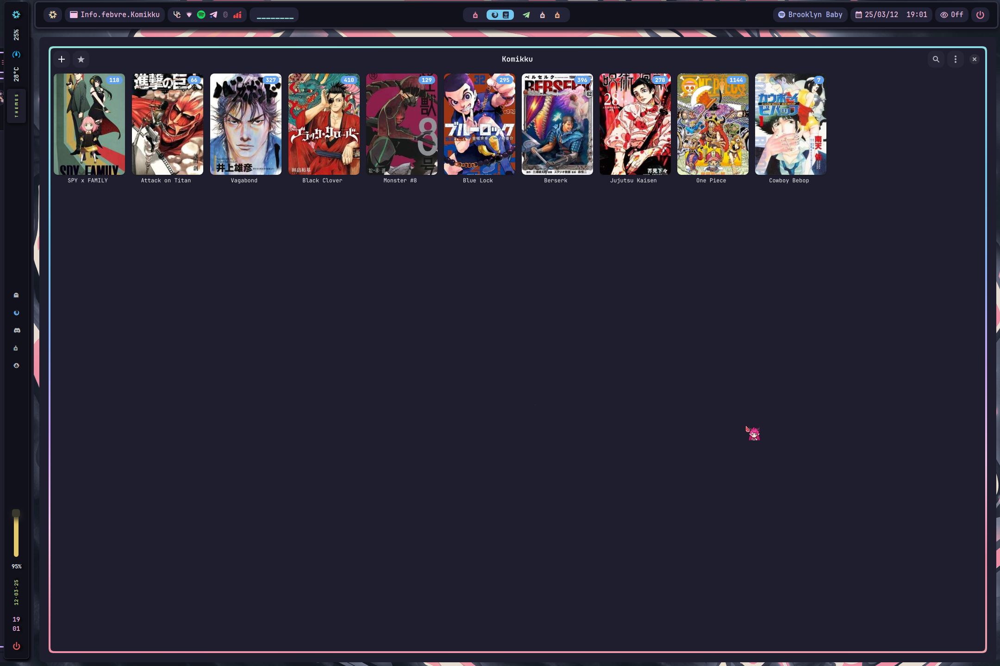
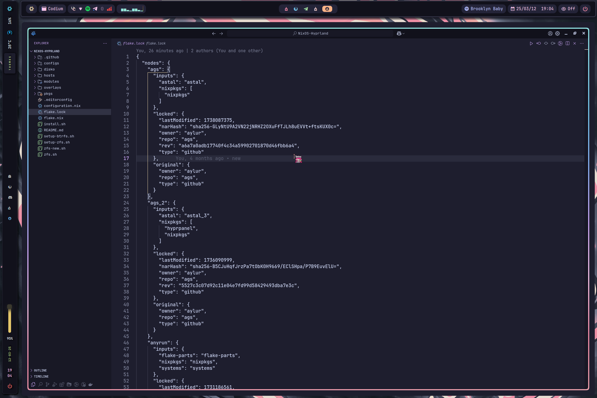
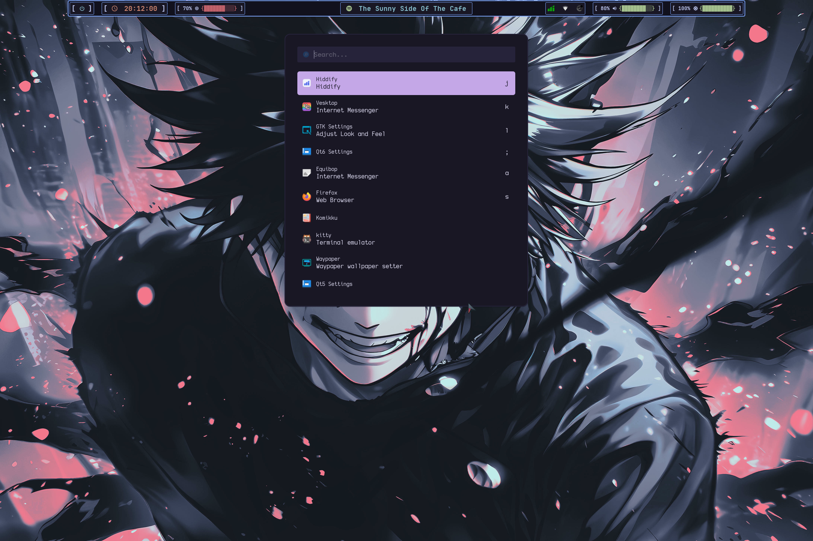
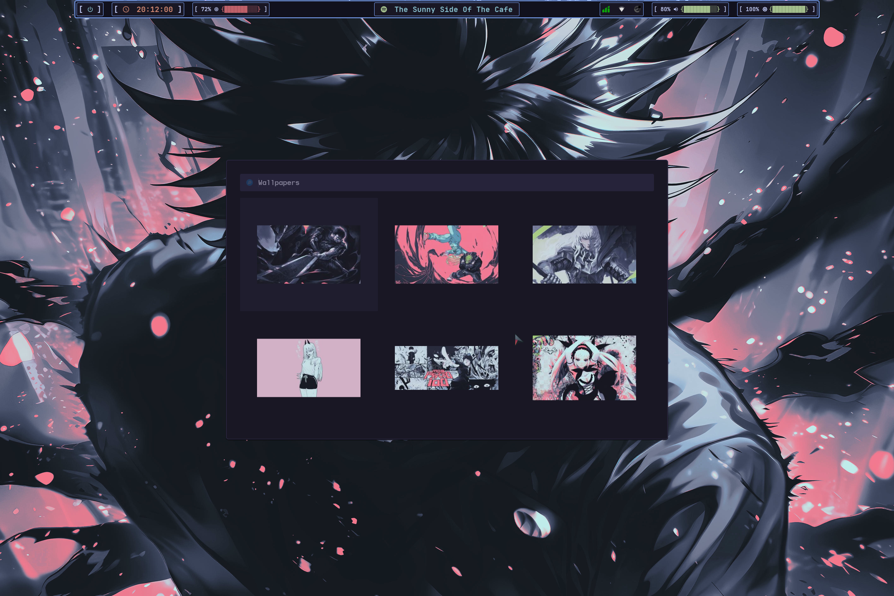
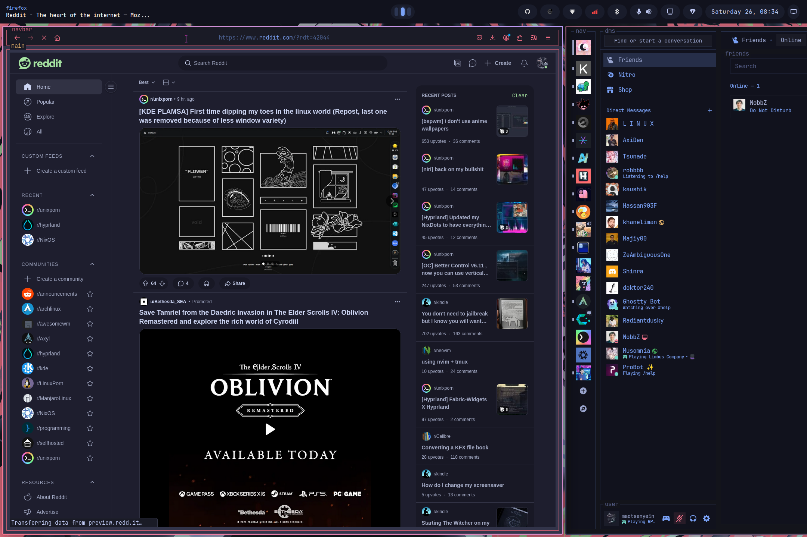
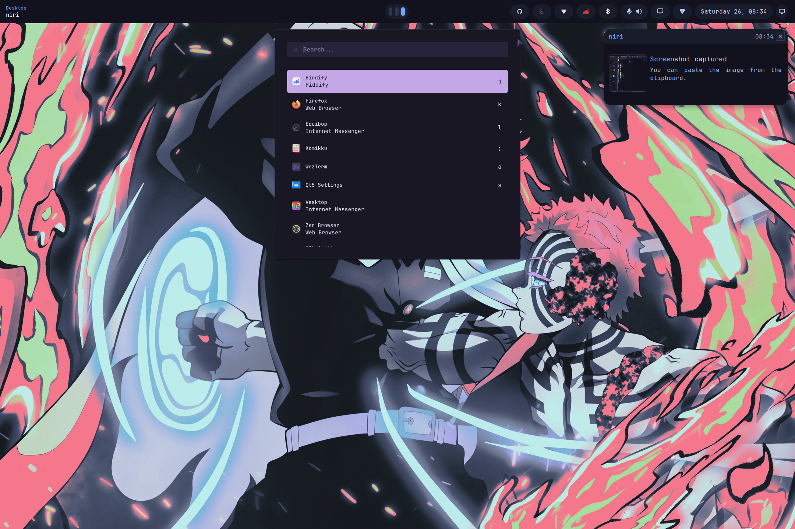
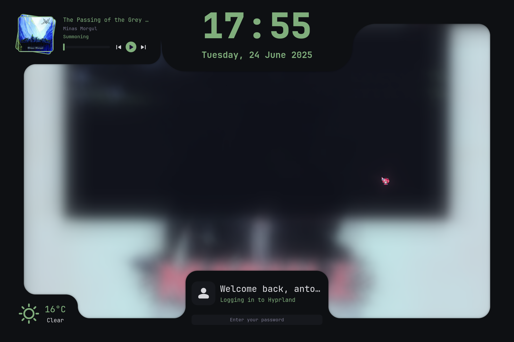

<h1 align="center">
    
    
      Shizuru  
    
       

   

      

      

         
         
         
         
      

       
   

</h1>

### 🖼️ Gallery for Hyprland (qs config is from this guy https://github.com/caelestia-dots/shell.git)

     
     
     
     
     
     

  Screenshots last updated <b>2025-4-29</b>

### 🖼️ Gallery for Niri the Goat

     
     
     
     
       
     

  Screenshots last updated <b>2025-6-23</b>

## ✨ Features

- ❄️ Flakes - for precise dependency management of the entire system.
- 🏡 hjem - to configure symlink to user directory.
- 💽 hjem-rum - hjem with modules system support.
- 📁 home-manager - on this time i do not fully change to hjem and hjem-rum so optional.
- ⚠️ Hyprland - As my window manager But secondary.  
- 💈 Niri - My Main WM.
- 💽 QuickShell - for my desktop enviornment.

## 📚 Layout

-   [flake.nix](flake.nix) base of the configuration
-   [hosts](hosts) 🌳 per-host configurations that contain machine specific configurations
    - [default](hosts/default/) 🖥️Default configurations for my desktop if you have laptop, use hostname as shizuru
    - [shizuru](hosts/shizuru/) 💻 Laptop specific configuration for my like
        - [config](hosts/shizuru/config.nix) kernel packages(cachyos kernel), scx enable(scx_lavd) and system level packages
        - [hardware](hosts/shizuru/hardware.nix) hardware configuration
        - [user](hosts/shizuru/user.nix) user specific packages(shell)
        - [variables](hosts/shizuru/variables.nix) user variables git username email
        - [hjem](hosts/shizuru/hjem.nix) hjem and hjem-rum modules 
        - [home](hosts/shizuru/home.nix) home-manager module
        - [theme](hosts/shizuru/theme.nix) theme related config
-   [modules](modules) 🍱 for more modularize
  - [system](system) for system wide config
    - [common](modules/system/common) kernel packages(cachyos kernel) systemd boot plymouth theme(catppuccin)
    - [desktop](modules/system/desktop) desktop related modules
    - [options](modules/system/options) options for laptop and desktop
    - [share](modules/system/share) share modules for laptop and desktop
  - [home-manager](home-manager) home-manager config
    - [ags](modules/home-manager/ags) ags home-manager modules(dont use) 
    - [Editor](modules/home-manager/editors) editor modules for nvchad
    - [Fabric-Bar](modules/home-manager/fabric) fabric bar config 
    - [Hana](modules/home-manager/hana) desktop related modules
    - [Media](modules/home-manager/media) media related modules
    - [Niri](modules/home-manager/niri) niri modules and config
    - [Ui](modules/home-manager/ui) ui related modules and config
    - [Zellij](modules/home-manager/zellij) zellij(not used) 
   

## 📓 Components
|                             | NixOS + Hyprland                                                                              |
| --------------------------- | :---------------------------------------------------------------------------------------------:
| **Window Manager**          | [Hyprland] |
| **Bar**                     | [HyprPanel] |
| **Application Launcher**    | [walker] |
| **Notification Daemon**     | ags|
| **Terminal Emulator**       | Wezterm + kitty |
| **Shell**                   | fish + atuin + [Starship] |
| **Text Editor**             | [VSCodium] + nix4nvchad |
| **network management tool** | [NetworkManager] + [network-manager-applet] |
| **System resource monitor** | Btop + Bottom |
| **File Manager**            | thunar + [yazi] |
| **Fonts**                   | LigaMono Nerd Font + JetBrainsMono Nerd Font|
| **Color Scheme**            | Catppuccin-Mocha + Catppuccin-Dark |
| **Cursor**                  | Chiharu |
| **Icons**                   | [Papirus-Dark] |
| **Lockscreen**              | [Hyprlock] |
| **Image Viewer**            |  imv |
| **Media Player**            | [mpv] |
| **Music Player**            | spotify |
| **Screenshot Software**     | [grimblast] |
| **kernel**                  | [linux cachyos kernel] |
| **Clipboard**               | [wl-clip-persist] |
| **Color Picker**            | [hyprpicker] |

# 👥 Credits

Other dotfiles that I learned / copy from:

- I really thanksful for frost-phoenix making this template and i credits to this man
 - [https://github.com/Frost-Phoenix/nixos-config/tree/catppuccin?tab=readme-ov-file]
- Nix Flakes
  - [nomadics9/NixOS-Flake](https://github.com/nomadics9/NixOS-Flake): This is where I start my nixos / hyprland journey.
  - [samiulbasirfahim/Flakes](https://github.com/samiulbasirfahim/Flakes): General flake / files structure
  - [justinlime/dotfiles](https://github.com/justinlime/dotfiles): Mainly waybar (old design)
  - [skiletro/nixfiles](https://github.com/skiletro/nixfiles): Vscodium config (that prevent it to crash)
  - [fufexan/dotfiles](https://github.com/fufexan/dotfiles)
  - [tluijken/.dotfiles](https://github.com/tluijken/.dotfiles): base rofi config
  - [mrh/dotfiles](https://codeberg.org/mrh/dotfiles): base waybar config
  - [JaKooLit/NixOS-Hyprland](https://github.com/JaKooLit/NixOS-Hyprland): my base config
  - [Matt-FTW/dotfiles](https://github.com/Matt-FTW/dotfiles.git): most of my dotfiles
  - [orangc/dots](https://github.com/orangci/dots.git): shout out to this man. He helps me in my begining of nixos jorney. If i didnt get help from this people i will leave this beautiful world.

  -[hmajid2301/nixicle](https://github.com/hmajid2301/nixicle.git): for some config idea
  - [nix-community/nix4nvchad](https://github.com/nix-community/nix4nvchad.git)
- README
  - [ryan4yin/nix-config](https://github.com/ryan4yin/nix-config)
  - [NotAShelf/nyx](https://github.com/NotAShelf/nyx)
  - [sioodmy/dotfiles](https://github.com/sioodmy/dotfiles)
  - [Ruixi-rebirth/flakes](https://github.com/Ruixi-rebirth/flakes)
  - [LinuxMobile](https://github.com/linuxmobile/kaku.git): for niri config and astal bar i love u man

- now my config is move to hjem and hjem-rum so sometime it breaks 
 - [hjem](https://github.com/feel-co/hjem.git)
 - [hjem-rum](https://github.com/snugnug/hjem-rum.git)

<!-- # ✨ Stars History -->

<!-- 

 -->

<!-- end of page, send back to the top -->

  <a href="#readme">Back to the Top</a>

<!-- Links -->
[Hyprland]: https://github.com/hyprwm/Hyprland
[HyprPanel]: https://github.com/Jas-SinghFSU/HyprPanel
[Wezterm]: https://wezfurlong.org/wezterm/index.html
[Starship]: https://github.com/starship/starship
[Waybar]: https://github.com/Alexays/Waybar
[walker]: https://github.com/abenz1267/walker
[Btop]: https://github.com/aristocratos/btop
[nemo]: https://github.com/linuxmint/nemo/
[yazi]: https://github.com/sxyazi/yazi
[zsh]: https://ohmyz.sh/
[oh-my-zsh]: https://ohmyz.sh/
[Swaylock-effects]: https://github.com/mortie/swaylock-effects
[Hyprlock]: https://github.com/hyprwm/hyprlock
[audacious]: https://audacious-media-player.org/
[mpv]: https://github.com/mpv-player/mpv
[VSCodium]:https://vscodium.com/
[Neovim]: https://github.com/neovim/neovim
[grimblast]: https://github.com/hyprwm/contrib
[qview]: https://interversehq.com/qview/
[swaync]: https://github.com/ErikReider/SwayNotificationCenter
[Nerd fonts]: https://github.com/ryanoasis/nerd-fonts
[NetworkManager]: https://wiki.gnome.org/Projects/NetworkManager
[network-manager-applet]: https://gitlab.gnome.org/GNOME/network-manager-applet/
[wl-clip-persist]: https://github.com/Linus789/wl-clip-persist
[wf-recorder]: https://github.com/ammen99/wf-recorder
[hyprpicker]: https://github.com/hyprwm/hyprpicker
[Catppuccin]: https://github.com/catppuccin 
[Papirus-Dark]: https://github.com/PapirusDevelopmentTeam/papirus-icon-theme
[Bibata-Modern-Ice]: https://www.gnome-look.org/p/1197198
[maxfetch]: https://github.com/jobcmax/maxfetch
