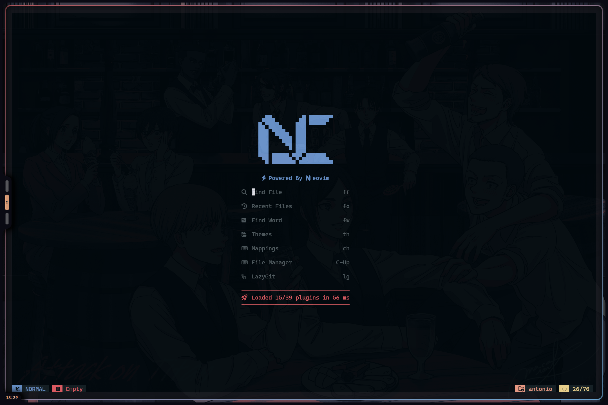
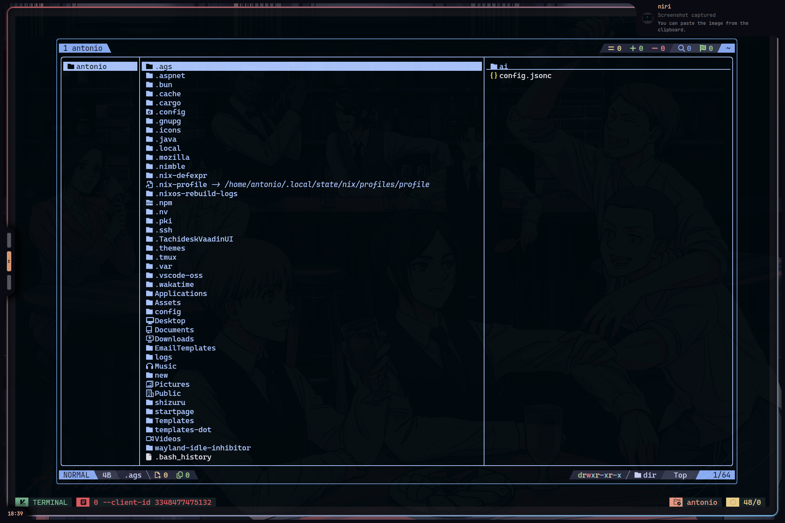

# 🧠 My NvChad Config

A beautiful and minimal custom configuration for [NvChad](https://github.com/NvChad/NvChad), tailored to my workflow.





---

## ✨ Features

- 🎨 Custom theme & UI tweaks
- ⚙️ Plugin additions & overrides
- ⌨️ Keybinding enhancements
- 🚀 Fast startup with lazy-loading

---

## 📥 Download

You can download this config as a zip:

👉 [Download Config](https://github.com/maotsugiri/nvchad-on-steroids)

Or clone directly:


```bash
git clone https://github.com/maotsugiri/nvchad-on-steroids ~/.config/nvim
```

---

### 🔗 Credits
[🎨 Base nvchad repo](https://github.com/NvChad/NvChad)  
[⚙️ base nix4nvchad repo](https://github.com/nix-community/nix4nvchad)  
